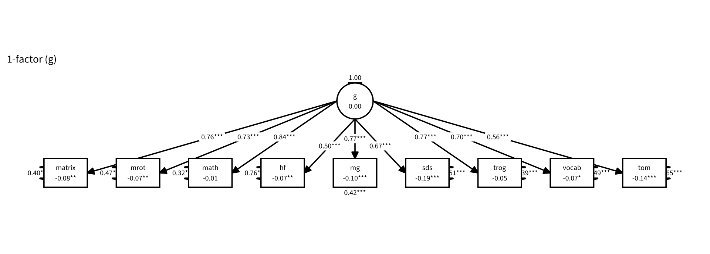
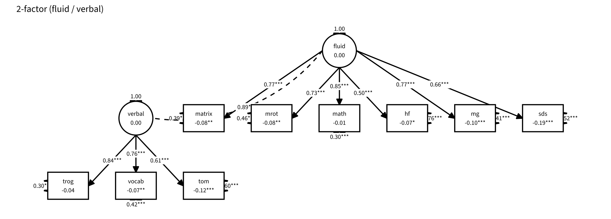
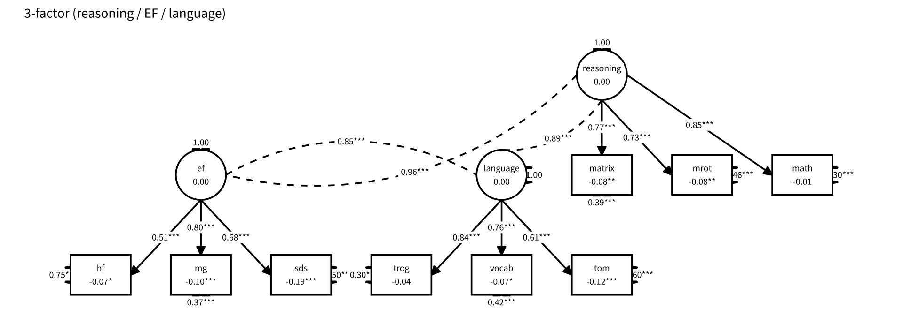

## The project & data

- Exploratory **longitudinal** analyses of LEVANTE core tasks — reproducible Quarto notebooks, shared `common.R`.
- Unified **`levante_data_latest`** (Redivis) via `rlevante`; now on **v1.2**, the corrected release.
- Four data-rich pilot sites: **Leipzig (DE)**, **Bogotá urban + rural (CO)**, **Western (CA)**.
- Cleaning: adaptive-flag backfill, ROAR-Word engagement filter.
- Stack: **00** load → **01** integrity → **02** growth → **03** SEM → **04** structure → **05** battery → **06–08** within-child variability; plus `tasks/` trial-level deep-dives.

## One methodological prerequisite: a scoring fix {.smaller}

- We found and fixed a **column-order bug** in `rlevante::score_irt` (items not reordered to the model's order before `mirt::fscores()`), worst for **CAT / guessing-floor** items.
- Validated (r = 1.00 vs gold scores; buggy 0.59–0.87) and corrected upstream → all analyses here use the bug-fixed **v1.2** release.
- *Everything that follows is on v1.2; we set the bug aside and focus on the psychometrics.*

## Construct structure: a strong general factor {.smaller}

(`03_structure_invariance`)

- Cross-sectional (N ≈ 2,000, 4 sites): a **strong general factor**.
- The three theory factors are **near-collinear** (reasoning–EF r ≈ 0.96).
- **Bifactor degenerate** — specific factors beyond *g* are negligible.
- Structure **replicates** across Germany, Bogotá, and Canada (per-site CFAs; DE + CA multigroup supports configural/metric invariance).

## The structural models {.smaller}

:::: {.columns}
::: {.column width="33%"}

:::
::: {.column width="33%"}

:::
::: {.column width="33%"}

:::
::::

Among *proper* models the **2-factor (fluid/verbal) is BIC-preferred**, tying the 3-factor on fit; the factors are near-collinear (r ≈ 0.85–0.96) and the bifactor's specifics degenerate — effectively **one general factor with ~two weakly-separable domains**.

## …resolving into ~two correlated dimensions {.smaller}

(`04_differentiation`, full 13-measure set incl. **MEFS** + **ROAR**)

- ESEM → **~2 correlated factors**: **fluid / nonverbal** + **verbal / literacy** (r ≈ 0.67).
- The added measures land where theory predicts: **MEFS → fluid**, **ROAR reading → verbal**.
- **Reasoning & EF do not separate** (fused ≈ 0.92) — there is no distinct EF factor.

## Abilities differentiate with age; *g* is substantive {.smaller}

:::: {.columns}
::: {.column width="48%"}
- **Local SEM:** the **fluid–verbal correlation falls with age** (0.93 → 0.83) — the two abilities differentiate. Per 03 this is **structural** (loadings ~age-invariant), not measurement drift.
- *g* is **not a method artifact**: a general response-**speed** factor exists but is ~orthogonal to cognitive *g* (r ≈ 0.15).
- *g* is **within-site**, not a site-mean effect.
:::
::: {.column width="52%"}

:::
::::

## Battery design: it's compressible {.smaller}

(`05_battery_design` — factor-score determinacy, Monte-Carlo validated)

:::: {.columns}
::: {.column width="50%"}
- Full **12-task** battery ≈ **59 min**, recovers factors at **0.94–0.96**.
- Cut to ≈ **31 min (8 tasks)** → still **0.91–0.95**. Dropping just **ToM + Same-&-Different** (→ ≈ 44 min) costs almost nothing.
- **Reading is the binding constraint** (keep ROAR-Word).
- A **~16-min, 4-task screener** recovers fluid/verbal at ≈ 0.90.
:::
::: {.column width="50%"}

:::
::::

## Within-child variability: the aim & overview {.smaller}

(`06_within_child_variability`) — a core LEVANTE goal: measure variability *within* children.

- Three naive indices: **RT intra-individual variability (IIV)**, **accuracy person-misfit**, **2-wave growth deviation**.
- **Null on coherence:** near-zero cross-task generality (r ≈ 0.05); the three indices mutually uncorrelated → no general "variability trait" naively.
- En route: confirmed the IRT models **do** apply a fixed guessing asymptote (g = chance) — so correctly-specified person-misfit is ≈ 0 reliable (its apparent signal was the ability confound).

## RT variability: a narrow but real signal {.smaller}

:::: {.columns}
::: {.column width="56%"}
(`07_rt_variability`)

- **Purified** RT-IIV: detrend within-task time-course + AR(1); all-trials validated as the better default.
- **Reliability tracks trial count** hard (≈ 0.5 at ≤ 25 trials → 0.94 at 120) → needs speeded, many-trial tasks.
- **Two weak strands**: a **speeded-task factor** (ROAR-Word/Sentence, H&F) + a weaker untimed-cognitive one — *not* one general trait.
- **Speeded factor** is the real one: declines with age (r ≈ −0.42), most stable longitudinally (H&F test–retest 0.47).
- **Site:** Bogotá markedly more RT-variable than Leipzig (+0.28 / +0.33 SD, age-adjusted).
:::
::: {.column width="44%"}

:::
::::

## RT-IIV: cross-task structure & development {.smaller}

:::: {.columns}
::: {.column width="50%"}

:::
::: {.column width="50%"}

:::
::::

## Accuracy variability: ability in disguise {.smaller}

(`08_accuracy_variability`)

:::: {.columns}
::: {.column width="52%"}
- Accuracy is binary → **MSSD** (trial-to-trial flip rate) is the appropriate index.
- Raw/detrended MSSD look reliable (≈ 0.44) and stable (≈ 0.38) — **but only because flip rate ≈ 2·p·(1−p) = (inverse) ability** (confound ≈ −0.7).
- **De-confounding** (excess / lag-1 autocorr) collapses reliability & stability to ~0 — robust to the baseline (observed-*p* **or** theta-IRF).
- No separable accuracy-instability trait. **Contrast:** RT keeps signal beyond mean RT; accuracy keeps none beyond accuracy level.
:::
::: {.column width="48%"}

:::
::::

## Task deep-dives (1/3): adaptive testing & engagement {.smaller}

- **Math:** Bogotá "regression to the mean" is a **CAT-routing artifact** (item selection shifts across waves), not within-child change; item bank unbalanced by sub-domain.
- **ROAR-Word:** super-low scores = **floor / non-engagement** (rushers, near-chance responders), not truncated runs → cleaning filter (acc < 0.4 or median RT < 500 ms).
- **Vocab:** apparent "decline" reflects **CAT item-exposure / floor**, not ability loss.

## Task deep-dives (2/3): measurement checks {.smaller}

- **Memory:** grid size (2×2 vs 3×3) **is** already modeled separately; difficulty cleanly ordered by span; replicates across sites → the "DROP" flag is **likely obsolete**.
- **Hearts & Flowers:** **2PL fits better than Rasch**; start trials are low-information.
- **Pattern Matching / Sentence Understanding:** **no reliable practice/retest effect** — the one clean longitudinal cell (Leipzig PM, equal length) shows no gain.

## Task deep-dives (3/3): items & stimuli {.smaller}

- **Stories / Theory of Mind:** reliable but **heterogeneous** (not unidimensional); question *type* organizes it more than story; controls drive most cross-language non-invariance; partial scalar invariance achievable.
- **Shape Rotation:** textbook **angle effect** on 2D/3D; the new **polygon** stimuli show a *reversed* angle effect (flag).
- **Sentence Understanding (TROG):** one **broken item** — German `embedding_cat_cow_chase_black` (~6.5 logits off).

## Cross-language measurement (DIF) {.smaller}

(`tasks/crosslang_dif_batch` + ToM & TROG)

- `multigroup_site` tasks are **broadly invariant** across English / Spanish / German — **Shape Rotation cleanest**.
- Math & Hearts-and-Flowers lower but **item-specific**, not global.
- Top Math flags = **multiplication / subtraction** → likely curriculum timing, not translation.
- ToM / TROG: targeted items show DIF; achievable **partial** scalar invariance on the rest.

## Synthesis / takeaways {.smaller}

- The battery measures a **strong general factor** resolving into **fluid + verbal/literacy** dimensions that **differentiate with age**.
- It is **compressible to ~half** its length with little loss of factor-score recovery.
- **Within-child variability:** usable signal lives in **RT on speeded, high-trial tasks** (declines with age); **accuracy** variability is essentially **ability** with nothing separable on top.
- Structure & most measurement properties **replicate across sites**; specific item/stimulus flags remain (broken TROG item, Shape-Rotation polygons, ToM heterogeneity).

## Open threads / next steps {.smaller}

- **More waves** → individual growth & second-order longitudinal models (two waves are underpowered).
- Re-do **Same & Different** and revisit the **Memory "DROP"** once new scoring lands.
- **Ex-Gaussian τ / drift-diffusion** on speeded tasks — the RT-variability frontier.
- Bring **MEFS** into the cross-language invariance work; flag the **TROG item** + **Shape-Rotation polygons** to the DCC.

## {.center}

*Sources: notebooks `00`–`08` and `tasks/*.qmd`. See `README.md` for the full index.*
