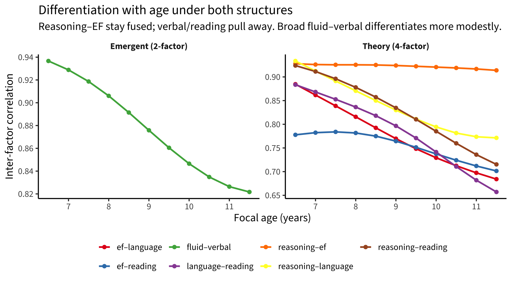
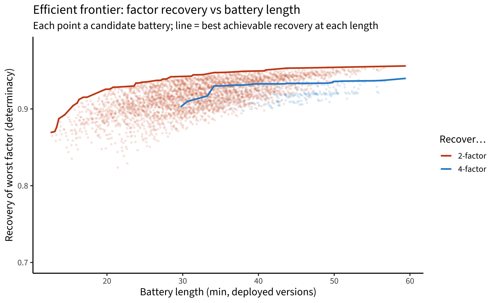
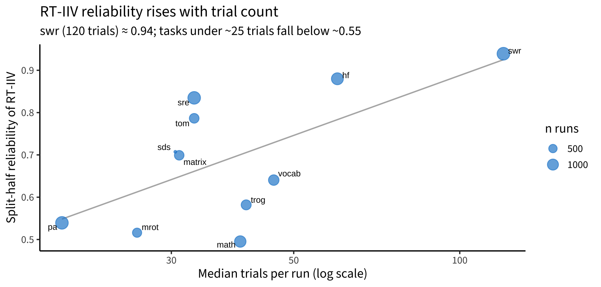
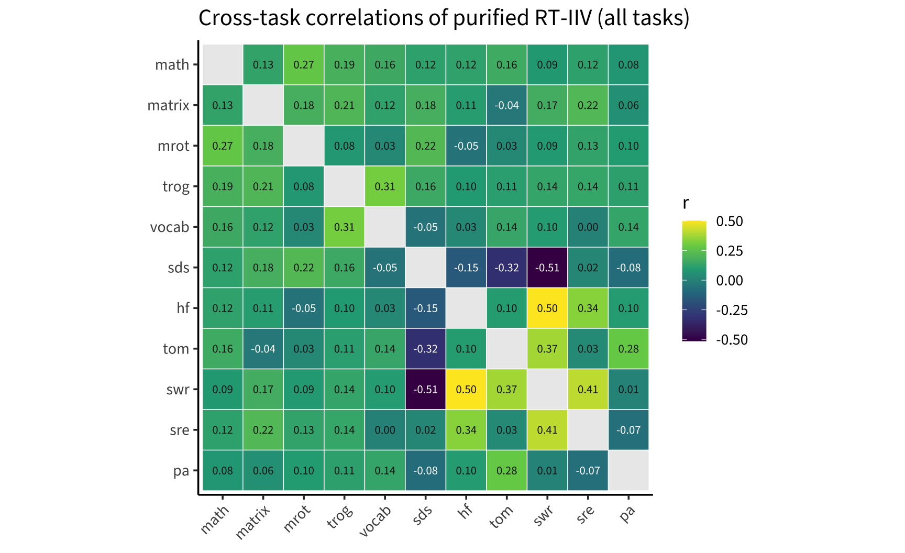
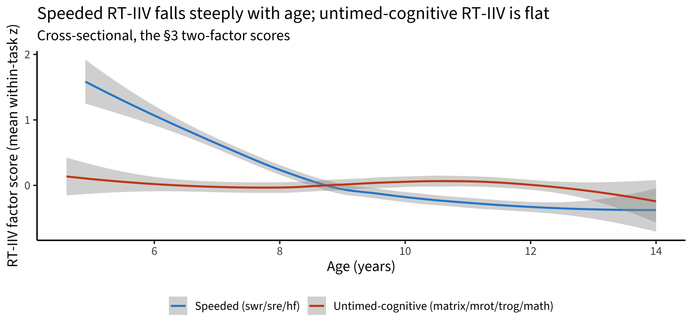
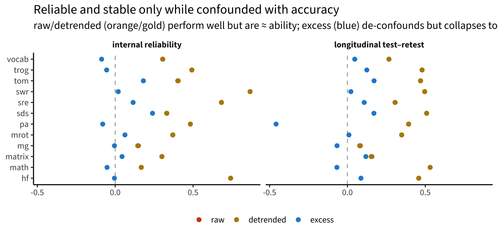

## The project & data

- Exploratory **longitudinal** analyses of LEVANTE core tasks — reproducible Quarto notebooks, shared `common.R`.
- Unified **`levante_data_latest`** (Redivis) via `rlevante`; now on **v1.2**, the bug-fixed release.
- Four data-rich pilot sites: **Leipzig (DE)**, **Bogotá urban + rural (CO)**, **Western (CA)**.
- Cleaning: adaptive-flag backfill, ROAR-Word engagement filter.
- Stack: **00** load → **01** integrity → **02** growth → **03** SEM → **04** structure → **05** battery → **06–08** within-child variability; plus `tasks/` deep-dives and `reports/`.

## Headline: a scoring bug, found and fixed

- Found a **column-order bug** in `rlevante::score_irt` — trial items were *not* reordered to the model's item order before `mirt::fscores()`.
- Worst for **CAT / guessing-floor** items; mis-scored the v1.0 release.
- **Validated** the fix (r = 1.00 vs gold scores; buggy versions 0.59–0.87), fixed upstream → re-released as **v1.2**.
- Write-up: `reports/rlevante_handoff.md`.

## The bug explained most "interesting" dynamics {.smaller}

On corrected v1.2, the eye-catching v1.0 phenomena largely **dissolve**:

- Apparent **longitudinal declines** → gone; growth uniformly positive (math steepest, ≈ 0.6 θ/yr).
- Bogotá math **"regression to the mean"** → a CAT-routing artifact, not within-child change.
- Leipzig **"mode shifts"** (math +2.37 → +0.30) → ≈ 85% the bug; residual < 0.75 logits (mild ceiling + EAP shrinkage).
- Pattern-Matching / Sentence-Understanding **"training effect" (T2 > T1)** → did **not** replicate.

## Construct structure: a strong general factor {.smaller}

(`03_sem_growth`)

- Cross-sectional (N ≈ 2,000, 4 sites): a **strong general factor**.
- The three theory factors are **near-collinear** (reasoning–EF r ≈ 0.96).
- **Bifactor degenerate** — specific factors beyond *g* are negligible.
- Structure **replicates** across Germany, Bogotá, and Canada (per-site CFAs; DE + CA multigroup supports configural/metric invariance).

## …resolving into ~two correlated dimensions {.smaller}

(`04_construct_structure`, full 13-measure set incl. **MEFS** + **ROAR**)

- ESEM → **~2 correlated factors**: **fluid / nonverbal** + **verbal / literacy** (r ≈ 0.67).
- The added measures land where theory predicts: **MEFS → fluid**, **ROAR reading → verbal**.
- **Reasoning & EF do not separate** (fused ≈ 0.92) — there is no distinct EF factor.

## Abilities differentiate with age; *g* is substantive {.smaller}

:::: {.columns}
::: {.column width="48%"}
- **Local SEM:** verbal/reading pull away from the fluid core with age (broad fluid–verbal 0.93 → 0.83; narrower factor pairs sharper).
- *g* is **not a method artifact**: a general response-**speed** factor exists but is ~orthogonal to cognitive *g* (r ≈ 0.15).
- *g* is **within-site**, not a site-mean effect.
:::
::: {.column width="52%"}

:::
::::

## Battery design: it's compressible {.smaller}

(`05_battery_design` — factor-score determinacy, Monte-Carlo validated)

:::: {.columns}
::: {.column width="50%"}
- Full **12-task** battery ≈ **59 min**, recovers factors at **0.94–0.96**.
- Cut to ≈ **31 min (8 tasks)** → still **0.91–0.95**. Dropping just **ToM + Same-&-Different** (→ ≈ 44 min) costs almost nothing.
- **Reading is the binding constraint** (keep ROAR-Word).
- A **~16-min, 4-task screener** recovers fluid/verbal at ≈ 0.90.
:::
::: {.column width="50%"}

:::
::::

## Within-child variability: the aim & overview {.smaller}

(`06_within_child_variability`) — a core LEVANTE goal: measure variability *within* children.

- Three naive indices: **RT intra-individual variability (IIV)**, **accuracy person-misfit**, **2-wave growth deviation**.
- **Null on coherence:** near-zero cross-task generality (r ≈ 0.05); the three indices mutually uncorrelated → no general "variability trait" naively.
- En route: confirmed the IRT models **do** apply a fixed guessing asymptote (g = chance) — so correctly-specified person-misfit is ≈ 0 reliable (its apparent signal was the ability confound).

## RT variability: a narrow but real signal {.smaller}

:::: {.columns}
::: {.column width="56%"}
(`07_rt_variability`)

- **Purified** RT-IIV: detrend within-task time-course + AR(1); all-trials validated as the better default.
- **Reliability tracks trial count** hard (≈ 0.5 at ≤ 25 trials → 0.94 at 120) → needs speeded, many-trial tasks.
- **Two weak strands**: a **speeded-task factor** (ROAR-Word/Sentence, H&F) + a weaker untimed-cognitive one — *not* one general trait.
- **Speeded factor** is the real one: declines with age (r ≈ −0.42), most stable longitudinally (H&F test–retest 0.47).
- **Site:** Bogotá markedly more RT-variable than Leipzig (+0.28 / +0.33 SD, age-adjusted).
:::
::: {.column width="44%"}

:::
::::

## RT-IIV: cross-task structure & development {.smaller}

:::: {.columns}
::: {.column width="50%"}

:::
::: {.column width="50%"}

:::
::::

## Accuracy variability: ability in disguise {.smaller}

(`08_accuracy_variability`)

:::: {.columns}
::: {.column width="52%"}
- Accuracy is binary → **MSSD** (trial-to-trial flip rate) is the appropriate index.
- Raw/detrended MSSD look reliable (≈ 0.44) and stable (≈ 0.38) — **but only because flip rate ≈ 2·p·(1−p) = (inverse) ability** (confound ≈ −0.7).
- **De-confounding** (excess / lag-1 autocorr) collapses reliability & stability to ~0 — robust to the baseline (observed-*p* **or** theta-IRF).
- No separable accuracy-instability trait. **Contrast:** RT keeps signal beyond mean RT; accuracy keeps none beyond accuracy level.
:::
::: {.column width="48%"}

:::
::::

## Task deep-dives (1/3): the "artifacts" were the bug {.smaller}

- **Math:** Bogotá "regression to the mean" = CAT routing, not within-child change; item bank unbalanced by sub-domain.
- **ROAR-Word:** super-low scores = **floor / non-engagement** (rushers, near-chance), not truncated runs → cleaning filter (acc < 0.4 or median RT < 500 ms).
- **Vocab:** German "decline" = the CAT serving very easy items (the bug), plus a genuine CO floor.

## Task deep-dives (2/3): measurement checks {.smaller}

- **Memory:** grid size (2×2 vs 3×3) **is** already modeled separately; difficulty cleanly ordered by span; replicates across sites → the "DROP" flag is **likely obsolete** (was the bug).
- **Hearts & Flowers:** **2PL > Rasch**; start trials are low-information.
- **Pattern Matching / Sentence Understanding:** the release-notes "T2 > T1 training effect" did **not** replicate on corrected data.

## Task deep-dives (3/3): items & stimuli {.smaller}

- **Stories / Theory of Mind:** reliable but **heterogeneous** (not unidimensional); question *type* organizes it more than story; controls drive most cross-language non-invariance; partial scalar invariance achievable.
- **Shape Rotation:** textbook **angle effect** on 2D/3D; the new **polygon** stimuli show a *reversed* angle effect (flag).
- **Sentence Understanding (TROG):** one **broken item** — German `embedding_cat_cow_chase_black` (~6.5 logits off).

## Cross-language measurement (DIF) {.smaller}

(`tasks/crosslang_dif_batch` + ToM & TROG)

- `multigroup_site` tasks are **broadly invariant** across English / Spanish / German — **Shape Rotation cleanest**.
- Math & Hearts-and-Flowers lower but **item-specific**, not global.
- Top Math flags = **multiplication / subtraction** → likely curriculum timing, not translation.
- ToM / TROG: targeted items show DIF; achievable **partial** scalar invariance on the rest.

## Data-quality status & handoffs {.smaller}

- **Known issues** logged in `00`: adaptive-flag backfill; ROAR engagement; residual EAP shrinkage at CAT/non-CAT boundaries; Memory & SDS release-note caveats.
- **rlevante handoff:** the `score_irt` bug (fixed) + documentation gaps — incl. the `item_parameters` table **omitting the guessing parameter** (a trap for anyone reconstructing the IRF).
- **Same & Different:** deferred pending new scoring models.

## Synthesis / takeaways {.smaller}

- **Fixing the scoring bug** was the highest-leverage result — most "findings" in v1.0 were artifacts.
- The battery measures a **strong fluid + verbal/literacy structure** that **differentiates with age**, and is **compressible to ~half** its length.
- **Within-child variability:** usable signal lives in **RT on speeded, high-trial tasks**; accuracy variability is essentially **ability**.
- Structure & most measurement properties **replicate across sites**; a handful of specific items/flags remain for the DCC.

## Open threads / next steps {.smaller}

- **More waves** → individual growth & second-order longitudinal models (two waves are underpowered).
- Re-do **Same & Different** and revisit the **Memory "DROP"** once new scoring lands.
- **Ex-Gaussian τ / drift-diffusion** on speeded tasks — the RT-variability frontier.
- Bring **MEFS** into the cross-language invariance work; flag the **TROG item** + **Shape-Rotation polygons** to the DCC.

## {.center}

*Sources: notebooks `00`–`08`, `tasks/*.qmd`, `reports/rlevante_handoff.md`. See `README.md` for the full index.*
